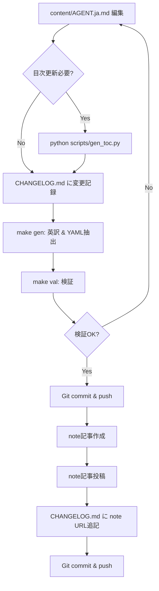

# PRD: Changelog分離とnoteミラーリング運用

**Document Version**: 1.0  
**Created**: 2025-10-13  
**Status**: Draft → Ready for Implementation  
**Owner**: nullvariant Project Team

---

## 📋 目次

1. [エグゼクティブサマリー](#1-エグゼクティブサマリー)
2. [背景と課題](#2-背景と課題)
3. [目標とスコープ](#3-目標とスコープ)
4. [要件定義](#4-要件定義)
5. [技術設計](#5-技術設計)
6. [実装フェーズ](#6-実装フェーズ)
7. [運用フロー](#7-運用フロー)
8. [成功指標](#8-成功指標)
9. [リスクと対策](#9-リスクと対策)
10. [付録](#10-付録)

---

## 1. エグゼクティブサマリー

### 1.1 目的
AGENT.ja.md のバージョン履歴を独立したChangelogドキュメントへ分離し、GitHub を真実の情報源（Single Source of Truth）、note を公開用ミラーとする運用体制を確立する。

### 1.2 主要な変更点
- **CHANGELOG.md** を新規作成し、全バージョン履歴を統合管理
- **AGENT.ja.md** の Version History セクションを簡略化
- 既存 note 記事の Changelog 部分を GitHub へ移行
- note 記事を「CHANGELOG + AGENT.ja.md 本文」構造で継続投稿

### 1.3 期待される成果
- ✅ バージョン履歴の一元管理と可読性向上
- ✅ AGENT.ja.md 本体のスリム化
- ✅ AI学習データとしての構造化された履歴提供
- ✅ note 記事との同期運用の明確化

---

## 2. 背景と課題

### 2.1 現状分析

#### 現在の運用
- **note 記事**: AI向け記事として「Changelog + AGENT.ja.md本文」を1記事として投稿
- **プラットフォーム特性**: note は AI学習を許可しているため、更新履歴も学習対象
- **管理課題**: AGENT.ja.md 内に Version History を記述すると文書が膨大化

#### GitHub 管理の必要性
- バージョン管理システムとの整合性
- 差分管理の容易さ
- 協業・レビューフローの確立
- 標準的な OSS プラクティスへの準拠

### 2.2 課題
1. **文書肥大化**: AGENT.ja.md に全履歴を含めると可読性が低下
2. **重複管理**: note と GitHub で異なる形式での管理
3. **同期コスト**: 手動コピーペーストによる更新漏れリスク
4. **検索性**: 過去の変更内容を探しにくい

---

## 3. 目標とスコープ

### 3.1 プロジェクト目標

#### Primary Goals
1. **構造化された Changelog 管理**: [Keep a Changelog](https://keepachangelog.com/ja/1.0.0/) 準拠
2. **GitHub を SSOT 化**: 全バージョン履歴を GitHub で一元管理
3. **note ミラーリング運用**: 公開用として note へ定型的に投稿

#### Secondary Goals
1. AI学習に最適化された履歴構造の提供
2. 既存 note 記事との後方互換性維持
3. 将来的な自動化基盤の構築

### 3.2 スコープ

#### In Scope
- ✅ CHANGELOG.md の作成とフォーマット定義
- ✅ AGENT.ja.md の Version History セクション簡略化
- ✅ 既存 note 記事からの Changelog 抽出と統合
- ✅ note 投稿テンプレートの作成
- ✅ 運用マニュアルの整備

#### Out of Scope
- ❌ note API を使った自動投稿（Phase 2 以降で検討）
- ❌ 他ドキュメント（EmotionMood_Dictionary.ja.md 等）への適用
- ❌ 英語版 Changelog の自動翻訳

---

## 4. 要件定義

### 4.1 機能要件

#### FR-1: CHANGELOG.md の構造
```yaml
必須要素:
  - バージョン番号（セマンティックバージョニング準拠）
  - リリース日（YYYY-MM-DD形式）
  - 変更カテゴリ（Added/Enhanced/Fixed/Changed/Deprecated/Removed/Security）
  - セクション参照（AGENT.ja.md の対象セクション番号）
  - 影響範囲（Impact）
  - 互換性情報（Compatibility）

推奨要素:
  - 感情辞書などの関連ドキュメントへのリンク
  - note 記事へのリンク（移行後）
  - 変更の背景や理由
```

#### FR-2: AGENT.ja.md の Version History
```markdown
要件:
  - 最新3バージョンのサマリーのみ表示
  - CHANGELOG.md への明確なリンク
  - 簡潔な説明（1-2行）
```

#### FR-3: note 記事構造
```markdown
構成:
  1. GitHub リンク（最新版への誘導）
  2. 当該バージョンの Changelog（CHANGELOG.md から抽出）
  3. AGENT.ja.md 本文全文
  4. フッターに GitHub リンク再掲
```

### 4.2 非機能要件

#### NFR-1: 可読性
- マークダウンレンダリング環境での視認性確保
- AI パーサーでの構造解析可能性

#### NFR-2: 保守性
- 標準フォーマット（Keep a Changelog）準拠
- コミット履歴との対応関係明確化

#### NFR-3: 拡張性
- バージョン別詳細ドキュメント（changelogs/*.md）への拡張可能性
- 自動化スクリプトとの統合を考慮した構造

---

## 5. 技術設計

### 5.1 ディレクトリ構造

```
nullvariant/
├── AGENT.md                          # 英語版（build.py生成）
├── CHANGELOG.md                      # 🆕 統合Changelog（全バージョン）
├── README.md
├── content/
│   ├── AGENT.ja.md                   # 📝 メイン仕様書（Version History簡略化）
│   └── EmotionMood_Dictionary.ja.md
├── changelogs/                       # 🆕 バージョン別詳細（オプション）
│   ├── v4.1.md
│   ├── v4.0.md
│   └── README.md                     # changelogs/ の説明
├── docs/
│   ├── AGENT.en.md
│   ├── OPERATIONS.ja.md
│   ├── PRD_CHANGELOG_MIGRATION.ja.md # 🆕 本ドキュメント
│   └── NOTE_SYNC_MANUAL.ja.md        # 🆕 note同期マニュアル
├── scripts/
│   ├── build.py
│   ├── gen_toc.py
│   ├── review.py
│   └── sync-to-note.sh               # 🆕 note同期スクリプト（将来）
└── spec/
    ├── agent.schema.json
    └── agent.spec.yaml
```

### 5.2 CHANGELOG.md フォーマット

```markdown
# Changelog

All notable changes to AGENT.ja.md will be documented in this file.

The format is based on [Keep a Changelog](https://keepachangelog.com/ja/1.0.0/),
and this project adheres to [Semantic Versioning](https://semver.org/spec/v2.0.0.html).

---

## [Unreleased]
### Planned
- （次回予定の変更）

---

## [4.1.0] - 2025-10-13
### Added
- **Section 2.1.1**: ペルソナ別感情プロファイル概要テーブル
  - 各ペルソナの典型的感情を[感情辞書](content/EmotionMood_Dictionary.ja.md)IDで明示化
  - 愛モード/恐怖モード/苦手感情/統合指針を体系化
  - 参照: [感情辞書 Appendix A](content/EmotionMood_Dictionary.ja.md#appendix-a)

- **Section 6.3**: 感情辞書活用ガイド
  - ペルソナ別感情プロファイル詳細（全6体）
  - 愛モード vs 恐怖モードの感情識別パターン
  - 日常的モニタリングと成長記録の手法

### Enhanced
- **Section 4.3**: 感情バッファを成分分離型へ進化
  - 感情IDによる透明化/吸収/返却の精密分類
  - エネルギー変換効率の数値化
  
- **Section 6.1.4**: EBI測定に「典型的感情状態マップ」追加
  - 全6ペルソナのEBI範囲別感情プロファイル
  - 各EBI帯域での推奨行動パターン

- **Appendix F**: 価値判断マトリクスに感情駆動パターン追加
  - 愛/恐怖モード判断の感情基盤を感情IDで明示
  - 典型的な判断フローの可視化

### Impact
- 🎯 感情を「測定・管理・育成可能なデータ」へ転換
- 🔗 EBI測定と感情辞書の完全統合
- 📊 システム状態の解像度が飛躍的向上

### Compatibility
- ✅ v4.0の全機能を保持
- ✅ 既存システムとシームレスに統合
- ⚠️ 感情辞書の参照が必須（EmotionMood_Dictionary.ja.md）

### Related Links
- [AGENT.ja.md v4.1](content/AGENT.ja.md)
- [感情辞書 v1.0](content/EmotionMood_Dictionary.ja.md)
- [note記事: v4.1アップデート](https://note.com/[account]/n/[note-id]) ※移行後追記

---

## [4.0.0] - YYYY-MM-DD
### Added
（既存note記事から抽出）

### Enhanced
（既存note記事から抽出）

---

## [3.x.x] - YYYY-MM-DD
（以下同様）

---

## External Resources
- [GitHub Repository](https://github.com/nullvariant/nullvariant)
- [note Magazine](https://note.com/[account]/m/m[magazine-id])
- [感情辞書](content/EmotionMood_Dictionary.ja.md)
```

### 5.3 AGENT.ja.md の Version History 簡略化

**変更前（現状）:**
```markdown
## Version History (バージョン履歴)

### v4.1 (2025-XX-XX)
【長文の詳細説明...】

### v4.0 (2025-XX-XX)
【長文の詳細説明...】

### v3.x (...)
【以下続く...】
```

**変更後（提案）:**
```markdown
## Version History (バージョン履歴)

> 📚 **詳細な変更履歴**: [CHANGELOG.md](../CHANGELOG.md) を参照してください。

### 最新バージョン
- **[v4.1.0](../CHANGELOG.md#410---2025-10-13)** (2025-10-13)  
  感情辞書統合アップデート - ペルソナ別感情プロファイル、EBI測定強化

- **[v4.0.0](../CHANGELOG.md#400---yyyy-mm-dd)** (YYYY-MM-DD)  
  6ペルソナシステム完全実装、EBI測定システム確立

### 過去のメジャーバージョン
- **v3.x**: 3ペルソナ統治システム
- **v2.x**: ポート理論実装
- **v1.x**: 初期システム設計

詳細は [CHANGELOG.md](../CHANGELOG.md) を参照。
```

### 5.4 note 記事テンプレート

```markdown
# [AGENT.ja.md] v4.1 感情辞書統合アップデート

> 🔗 **最新版は GitHub で管理しています**  
> https://github.com/nullvariant/nullvariant  
> 本記事は AI学習用に note へミラーリングしたものです。

---

## 📋 v4.1 アップデート内容

【CHANGELOG.md の該当バージョンをコピー】

---

## 📖 AGENT.ja.md 本文

【content/AGENT.ja.md 全文をコピー】

---

## 🔗 関連リンク

- **GitHub リポジトリ（最新版）**: https://github.com/nullvariant/nullvariant
- **Changelog 全体**: https://github.com/nullvariant/nullvariant/blob/main/CHANGELOG.md
- **感情辞書**: https://github.com/nullvariant/nullvariant/blob/main/content/EmotionMood_Dictionary.ja.md

---

💡 **GitHub が真実の情報源（Single Source of Truth）です**  
本 note 記事は公開・学習用のミラーであり、最新の更新は常に GitHub で行われます。

#AI #AIエージェント #6ペルソナシステム #感情辞書 #EBI測定
```

---

## 6. 実装フェーズ

### Phase 1: 基盤構築（Week 1）

#### Task 1.1: ディレクトリ・ファイル作成
```bash
# 実行コマンド
mkdir -p changelogs
touch CHANGELOG.md
touch changelogs/README.md
touch docs/NOTE_SYNC_MANUAL.ja.md
```

**成果物:**
- [ ] `CHANGELOG.md` 作成
- [ ] `changelogs/` ディレクトリ作成
- [ ] `changelogs/README.md` 作成（用途説明）
- [ ] `docs/NOTE_SYNC_MANUAL.ja.md` 作成

#### Task 1.2: CHANGELOG.md 初期構造作成
- Keep a Changelog フォーマット適用
- v4.1 の内容を記述（サンプルとして）
- Unreleased セクション作成

#### Task 1.3: AGENT.ja.md 修正
- Version History セクションを簡略化
- CHANGELOG.md へのリンク追加
- 最新3バージョンのみサマリー表示

**検証基準:**
- [ ] CHANGELOG.md が GitHub でレンダリング正常
- [ ] AGENT.ja.md のリンクが正しく動作
- [ ] マークダウンリンター（markdownlint）通過

---

### Phase 2: データ移行（Week 1-2）

#### Task 2.1: 既存 note 記事の棚卸し
- 全 note 記事のリストアップ
- バージョン番号と公開日の整理
- Changelog 部分の特定

**成果物:**
```markdown
docs/NOTE_ARTICLES_INVENTORY.md

| note記事ID | バージョン | 公開日 | URL | 移行状況 |
|-----------|-----------|--------|-----|---------|
| n-xxx     | v4.0      | 2025-XX-XX | https://... | 未 |
| n-yyy     | v3.5      | 2025-XX-XX | https://... | 未 |
```

#### Task 2.2: Changelog 抽出
- 各 note 記事から Changelog 部分をコピー
- 日付・バージョン番号の正規化
- カテゴリ分類（Added/Enhanced/etc.）

#### Task 2.3: CHANGELOG.md へ統合
- 時系列順（新→古）に並べる
- フォーマット統一
- セクション参照の追加

**検証基準:**
- [ ] 全バージョンが CHANGELOG.md に記載
- [ ] 抜け漏れなし（note記事と照合）
- [ ] リンク切れなし

---

### Phase 3: 運用体制確立（Week 2-3）

#### Task 3.1: note 同期マニュアル作成
`docs/NOTE_SYNC_MANUAL.ja.md` に以下を記載:
- アップデート時の手順
- note 記事テンプレート
- チェックリスト

#### Task 3.2: 運用テスト
- ダミーのマイナーアップデート（v4.1.1等）を想定
- 全工程を実行してみる
- 所要時間計測

#### Task 3.3: OPERATIONS.ja.md への追記
既存の `docs/OPERATIONS.ja.md` に Changelog 運用フローを追加:

```markdown
## X. Changelog 運用フロー

### X.1 アップデート時の手順
1. content/AGENT.ja.md を編集
2. CHANGELOG.md に変更を記録
3. make gen でビルド
4. make val で検証
5. Git commit & push
6. note 記事作成（NOTE_SYNC_MANUAL.ja.md 参照）

### X.2 バージョニングルール
- Major (x.0.0): アーキテクチャ変更、破壊的変更
- Minor (4.x.0): 新機能追加、大幅強化
- Patch (4.1.x): バグ修正、小改善

詳細: [PRD_CHANGELOG_MIGRATION.ja.md](PRD_CHANGELOG_MIGRATION.ja.md)
```

**成果物:**
- [ ] `docs/NOTE_SYNC_MANUAL.ja.md` 完成
- [ ] 運用テスト完了レポート
- [ ] `docs/OPERATIONS.ja.md` 更新

---

### Phase 4: 自動化検討（Week 4〜、オプション）

#### Task 4.1: note 同期スクリプト（検討）
```bash
scripts/sync-to-note.sh
```

**機能案:**
- CHANGELOG.md と AGENT.ja.md を結合
- note 用のマークダウン整形
- クリップボードへコピー（手動投稿補助）

**注意:**
- note 公式APIは存在しない
- 非公式手法はリスクあり
- Phase 1-3 完了後に慎重に検討

#### Task 4.2: GitHub Actions 統合
- CHANGELOG.md 更新を検知
- note 記事テンプレート自動生成
- Artifact として出力

**成果物:**
- [ ] `.github/workflows/changelog-mirror.yml` （検討案）
- [ ] 自動化の是非判断ドキュメント

---

## 7. 運用フロー

### 7.1 通常アップデート時



### 7.2 詳細手順（チェックリスト形式）

#### ステップ1: ローカル編集
- [ ] `content/AGENT.ja.md` を編集
- [ ] 必要なら `python scripts/gen_toc.py` 実行
- [ ] `CHANGELOG.md` の `[Unreleased]` セクションに変更を記録

#### ステップ2: バージョン確定
- [ ] バージョン番号を決定（SemVer準拠）
- [ ] `CHANGELOG.md` で Unreleased → バージョン番号に変更
- [ ] リリース日を記入

#### ステップ3: ビルドと検証
```bash
make gen  # 英訳 & YAML抽出
make val  # スキーマ検証
```
- [ ] エラーがないことを確認

#### ステップ4: GitHub へコミット
```bash
git add CHANGELOG.md content/AGENT.ja.md AGENT.md spec/agent.spec.yaml
git commit -m "Release v4.x.x: [変更サマリー]"
git push origin main
```

#### ステップ5: note 記事作成
- [ ] `docs/NOTE_SYNC_MANUAL.ja.md` のテンプレートを使用
- [ ] CHANGELOG.md の該当バージョンをコピー
- [ ] AGENT.ja.md 全文をコピー
- [ ] GitHub リンクを記載

#### ステップ6: note 投稿後
- [ ] note 記事 URL をコピー
- [ ] `CHANGELOG.md` の該当バージョンに URL を追記
```markdown
### Related Links
- [note記事: v4.1アップデート](https://note.com/xxx/n/nyyy)
```
- [ ] Git commit & push

---

## 8. 成功指標

### 8.1 定量指標

| 指標 | 目標値 | 測定方法 |
|------|--------|----------|
| Changelog 完全性 | 100% | 全バージョンが CHANGELOG.md に記載 |
| note 同期遅延 | 24時間以内 | GitHub commit → note投稿の時間差 |
| リンク切れ | 0件 | 定期的なリンクチェック |
| アップデート作業時間 | 30分以内 | ストップウォッチ計測 |

### 8.2 定性指標

- [ ] CHANGELOG.md が可読性高く、変更内容が理解しやすい
- [ ] AI学習データとして構造化されている
- [ ] note 読者からの混乱がない（GitHub が最新と認識されている）
- [ ] 開発者の運用負荷が軽減されている

### 8.3 マイルストーン

- **M1** (Week 1): CHANGELOG.md 作成完了
- **M2** (Week 2): 既存データ移行完了
- **M3** (Week 3): 初回の新規アップデートで運用フロー実践
- **M4** (Week 4): 運用マニュアル完成、PRD 完了

---

## 9. リスクと対策

### 9.1 リスクマトリクス

| リスク | 影響度 | 発生確率 | 対策 |
|--------|--------|----------|------|
| note記事からの抽出漏れ | 高 | 中 | 抽出後のクロスチェック、棚卸しリスト作成 |
| CHANGELOG.md フォーマット不統一 | 中 | 中 | テンプレート厳守、レビュープロセス |
| note 同期忘れ | 中 | 中 | チェックリスト運用、定期リマインダー |
| GitHub-note間のリンク切れ | 低 | 低 | 定期的なリンクチェッカー実行 |
| 自動化スクリプトの不具合 | 低 | 低 | Phase 4（自動化）は慎重に段階実施 |

### 9.2 コンティンジェンシープラン

#### リスク: note記事からの抽出漏れ
**対策:**
1. `docs/NOTE_ARTICLES_INVENTORY.md` で全記事をリスト化
2. 各記事のチェックボックスで進捗管理
3. 移行完了後、2名以上でクロスチェック

#### リスク: note 同期忘れ
**対策:**
1. `docs/NOTE_SYNC_MANUAL.ja.md` のチェックリスト必須実施
2. GitHub commit メッセージに note 投稿の TODO を記載
3. 週次レビューで未同期バージョンをチェック

---

## 10. 付録

### 10.1 用語集

| 用語 | 説明 |
|------|------|
| **SSOT** | Single Source of Truth: 真実の情報源は1つであるべきという原則 |
| **SemVer** | Semantic Versioning: x.y.z 形式のバージョニング規則 |
| **Keep a Changelog** | Changelog の標準フォーマット（https://keepachangelog.com/） |
| **Mirror** | 主データのコピーを別の場所で公開すること |

### 10.2 参考資料

- [Keep a Changelog（日本語）](https://keepachangelog.com/ja/1.0.0/)
- [Semantic Versioning 2.0.0](https://semver.org/spec/v2.0.0.html)
- [note ヘルプ: AI学習について](https://help.note.com/)
- [GitHub Docs: Managing releases](https://docs.github.com/en/repositories/releasing-projects-on-github)

### 10.3 関連ドキュメント

- [OPERATIONS.ja.md](OPERATIONS.ja.md): 全体の運用ガイド
- [CONTRIBUTING.md](../CONTRIBUTING.md): コントリビューションガイドライン
- [README.md](../README.md): プロジェクト概要

### 10.4 変更履歴（本PRD）

| バージョン | 日付 | 変更内容 | 著者 |
|-----------|------|----------|------|
| 1.0 | 2025-10-13 | 初版作成 | nullvariant |

---

## 承認

| 役割 | 氏名 | 承認日 | 署名 |
|------|------|--------|------|
| プロジェクトオーナー | - | - | - |
| 技術レビュアー | - | - | - |

---

**Document Status**: 🟡 Draft → Ready for Implementation  
**Next Action**: Phase 1 Task 1.1 の実行開始

---

_このドキュメントは nullvariant プロジェクトの運用改善のために作成されました。_
_質問や提案がある場合は、GitHub Issues でお知らせください。_
